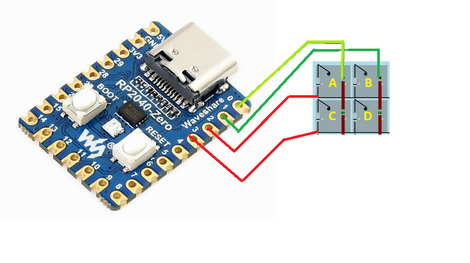

# flash firmware - step 0
Il macropad funziona grazie alla una MCU Board, abbia usato un RP2040-Zero Waveshare
https://www.waveshare.com/wiki/RP2040-Zero

Per poter scrivere le istruzioni per la MCU abbiamo flashato il firmware CircuitPython
https://circuitpython.org/board/waveshare_rp2040_zero/

Per fare il flash
https://www.youtube.com/watch?v=YcYVBJw6KHE

Se non funziona come nel video è necessario fare un reset in questo modo:
- tenere premuto il tasto reset
- inserire il cavo nel pc
- premere il tasto boot
- rilasciare il tasto reset
- rilasciare il tasto boot 

Una volta flashato il firmware sarà possibile modificare il file `code.py` trovato all'interno del MCU quando viene connesso al pc.

# installazione librerie - step 1
Aggiungiamo al MCU le librerie che ci aiutano a programmare le funzionalità della board.

- fai il download della libreria kmk https://github.com/KMKfw/kmk_firmware clic su `code`>`download Zip`
- estrai il file zip
- copia la cartella kmk e il file boot.py dentro la MCU board

qui la guida ufficiale https://github.com/KMKfw/kmk_firmware/blob/main/docs/en/Getting_Started.md

# sviluppo - step 2
all'interno del MCU è presente il file `code.py` che è l'unico file che dobbiamo modificare a mano per poter far funzionare il macropad

Il file code.py è scritto in python ed è strutturato in questo modo
Si può modificare il file con qualsiasi editor di testo, nel laboratorio abbiamo usato `mu editor` `visual studio code`

In Python i commenti sono preceduti dal simbolo `#`, un commento è del testo che non è un istruzione ma che serve solo al programmatore come aiuto semantico.

Qui un esempio base base di come deve essere `code.py`
```python
import board
from kmk.kmk_keyboard import KMKKeyboard
from kmk.keys import KC
from kmk.scanners import DiodeOrientation

# inizializzazione della tastiera
keyboard = KMKKeyboard()

# definizione dei pin dove sono saldate le colonne e le righe di tasti, in questo caso la tastiera è 2 righe e 2 colonne
keyboard.col_pins = (board.GP0, board.GP1)
keyboard.row_pins = (board.GP2, board.GP3)
keyboard.diode_orientation = DiodeOrientation.COL2ROW

# definizione delle funzionalità dei tasti 
keyboard.keymap = [
    [
        KC.A, KC.B  # riga 1: primo tasto -> A ; secondo tasto -> B
        KC.C, KC.D  # riga 2: primo tasto -> C ; secondo tasto -> D
    ]
]

if __name__ == '__main__':
    keyboard.go()
```

Questo è il codice necessario per un semplice macropad con quattro tasti, righe saldate su PIN 2 e 3, colonne saldate su PIN 0 e 1


